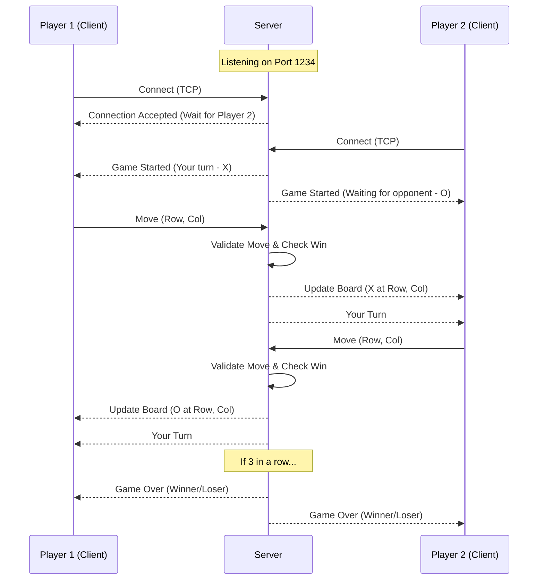
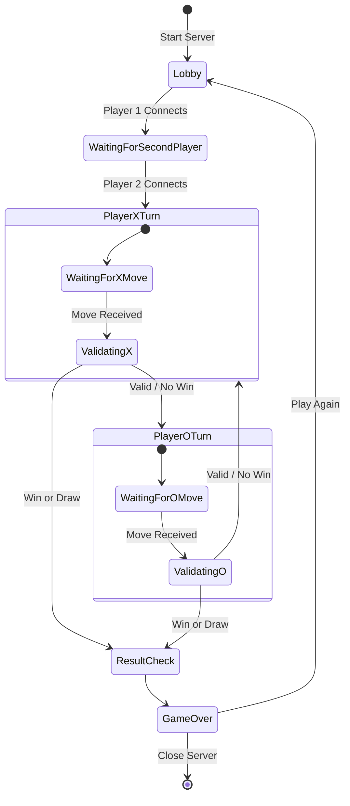

# Tic-Tac-Toe: Client-Server Multiplayer (Qt & C++)

implementation of the classic **Tic-Tac-Toe** game featuring a graphical user interface (GUI) and a networking layer. This project follows a **Client-Server architecture**, allowing two players to compete over a network using TCP sockets.

## 🚀 Features
- **Network Multiplayer:** Play against another person over a TCP/IP connection.
- **Dedicated Server:** Manages game state, validates moves, and detects win/draw conditions.
- **Qt GUI:** A clean and responsive interface built with C++ and the Qt Framework.
- **Real-time Synchronization:** Instant updates between both players.

## 🛠 Tech Stack
- **Language:** C++
- **Framework:** Qt (5 or 6)
- **Networking:** QTcpServer, QTcpSocket
- **Build System:** qmake

---

## 🔧 Launch Instructions

### 1. Launch the Server
- Open the **Server project file** (`.pro`) in **Qt Creator**.
- Build and run the project. 
- The server will start listening on a designated port (default: `1234`).

### 2. Launch the Clients
- Open the **Client project file** (`.pro`) in **Qt Creator**.
- Set the **Server IP** (use `127.0.0.1` for local testing on the same machine).
- Build and run **two separate instances** of the client application.

---

## 🎮 How to Play
1. **Start the Server first:** Ensure the server is running and ready to accept connections.
2. **Connect Player 1:** Open Client 1 (assigned as Player X) and click connect.
3. **Connect Player 2:** Open Client 2 (assigned as Player O) and click connect.
4. **Game Start:** Once both players are connected, the game board unlocks automatically.
5. **Gameplay:** Take turns clicking on the 3x3 grid until a winner is declared or the game ends in a draw

---

## 📊 Sequence Diagram

## 📊 State Diagram

---
## 📋 Requirements
- **Qt SDK** installed (with a valid C++ compiler like MinGW or MSVC).
- Network access (if playing across different computers).

## 🤝 Contributing
Feel free to fork this repository, report issues, or submit pull requests for new features like custom board sizes or a chat system.

**Developed by [TomasN123](https://github.com/TomasN123)**
